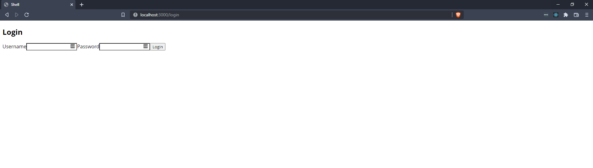
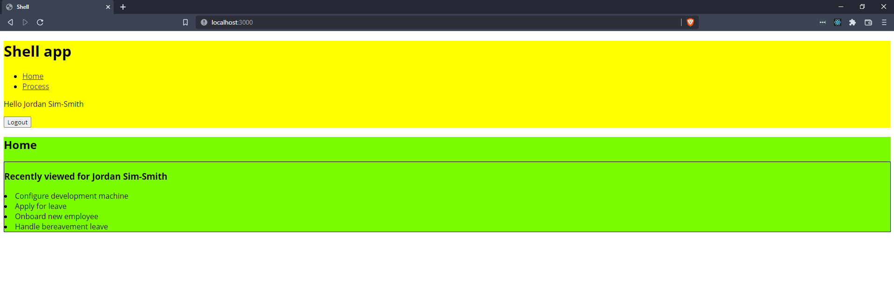
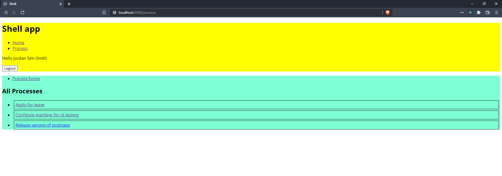
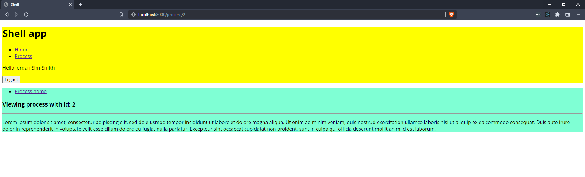

# promapp-microfrontends

Proof of concept exploring the usage of microfrontends for Nintex Promapp.

## Requirements

1. Shell application and microfrontends can be deployed separately, and code is combined at runtime ✅
1. Microfrontends are framework agnostic ✅
1. Shell application handles top level routing, microfrontends can handle nested routing ✅
1. Microfrontends can be developed/tested in isolation ✅
1. Local shell application can combine local and remote microfrontends during development ✅
1. Dependencies can be shared between microfrontends (e.g. React), and loaded once ✅
1. Identity information is shared between microfrontends ✅

## Technical overview

- Webpack 5 module federation used to share microfrontend code at runtime.
- Shell application (yellow) written in React, with React Router for top level routing.
- Home microfrontend (green) written in Svelte, demoing a dummy API call.
- Process microfrontend (blue) written in React, with React Router for nested routing.
- Shell applicaiton handles the dummy login page, and provides the user identity model and access token to each microfrontend.
- Microfrontends expose `mount` and `unmount` lifecycle methods, which are called appropriately by the shell application via [RemoteComponent.tsx](./shell/src/RemoteComponent.tsx).
- React versions are eager shared between federated modules. Each required version of React will only be loaded once.

## Local development

- In each of the `shell`, `home-microfrontend` and `process-microfrontend` directories, run:
  - `npm install`
  - `npm run start`
- Visit [localhost:3000](http://localhost:3000).

## Preparing for production

- Federated module remote urls in each `webpack.config.js` can be provided by the build pipelines, instead of hard coding local urls.
- Typings can be exported as an npm package, and added as a dependency to each microfrontend, instead of duplication.
- Other large, common libraries can be shared between federated modules.

## Screenshots

  
  
  

